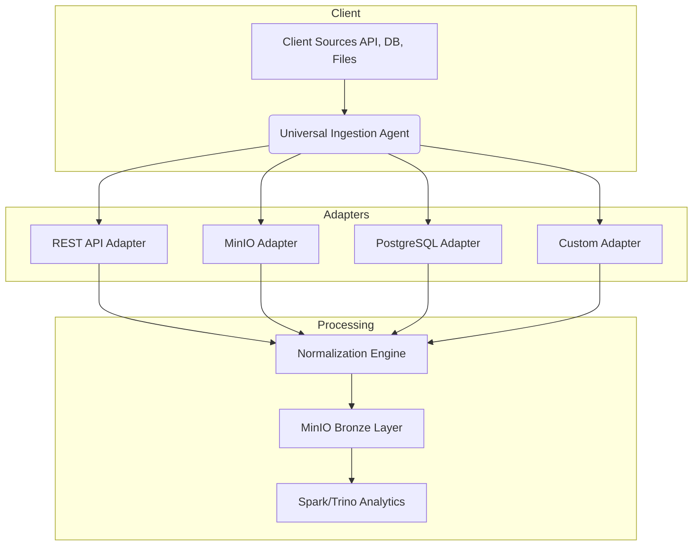

# Hexadone - Universal Ingestion Agent

## How to Run (using poetry - Recommended)
#### Install dependencies:

`poetry install`

#### Install dev dependencies (testing/linting):

`poetry install --with dev`

#### Run:

`poetry run ingestion-agent --template templates/rest_api_adapter.yaml`

#### Test:
Run all tests

`poetry run pytest`

With coverage report

`poetry run pytest --cov=ingestion_agent`

## How to Run (without poetry)

#### Install dependencies:

`pip install pandas pyyaml minio requests pydantic jinja2`

Place config templates in templates/.

#### Run:

`python main.py \
  --template templates/rest_api_adapter.yaml \
  --vars-file configs/client_vars.yaml`

### Test:

#### Install dependencies:
`pip install pytest pytest-mock pytest-cov`

#### Run Tests:

#####  All tests
`pytest tests/`

##### With coverage report
`pytest --cov=adapters --cov=adapter_factory tests/`